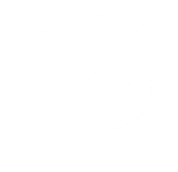

<!--Heading-->
<h1 align='center'>
	
	<p>
		<strong>
			Website Portfolio
		</strong>
	</p>
</h1>
<p align='center'>
	• In the <strong>NextJS</strong> project, a website was created to serve as a <strong>resume</strong>, and to test my <strong>programming skills</strong> and <strong>abilities</strong>.
</p>
<p align='center'>
  <a href='https://pedrovisk.ml/'>
    
  </a>
</p>
<!--/Heading-->

#### **`.env ` file exemple**
```
WEATHER_KEY= Get API Key in https://www.weatherapi.com/
LASTFM_KEY= Get API Key in https://www.last.fm/pt/api
WAKAPI_KEY= Get API Key in https://wakapi.dev/
WEBHOOK_URL= Discord Webhook URL
```

<!--Section-->
<br />
<p align='center'>
  ⚙️ Languages and tools used in the project
</p>
<p align='center'>
  &nbsp;&nbsp;
  &nbsp;&nbsp;
  &nbsp;&nbsp;
  &nbsp;&nbsp;
  
</p>
<br/>
<!--/Section-->

<!--Footer-->
<h2>
	LICENSE
</h2>
<p>
	This project is licensed under <strong>MIT</strong>, which basically means you can do anything you want with it, i only ask that you include a small copyright notice and a link to this repo in a comment in your source code.
</p>
<!--/Footer-->
